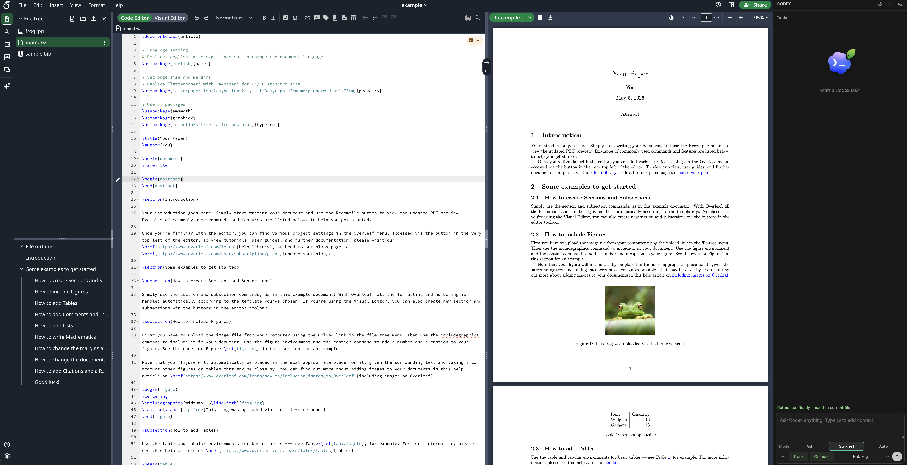

<div align="center">
  
  <h1>Codex Overleaf Link</h1>
  <p><strong>Empower Overleaf with Codex.</strong></p>
  <p>
    
    
    
    
    <a href="https://github.com/Ghqqqq/codex-overleaf-link/actions/workflows/test.yml"></a>
    
    
  </p>
</div>

---

## Why

Overleaf is great for collaborative LaTeX writing. Codex is great for AI-assisted editing. But switching between them breaks flow — you lose Overleaf's real-time collaboration, or you lose Codex's local intelligence.

Codex Overleaf Link bridges the two: it adds a Codex panel directly inside Overleaf, mirrors the project locally for Codex to work on, and writes accepted changes back through the browser — with stale-write guards, diff review, and undo checkpoints to reduce the risk of accidental overwrites.

<p align="center">
  
</p>

## Install

Codex Overleaf Link has two parts: a **native host** (a local Node bridge) and the **Chrome extension**. Pick one of the two install paths below, then open Overleaf.

Either way, the final **Load unpacked** click is manual — Chrome does not let any installer or script load an unpacked extension for you.

### Option A — installer script (recommended)

One command installs the native host **and** sets up the extension: the script registers the native host, places the extension folder at `~/Codex Overleaf Link Extension`, copies that path to your clipboard, and opens `chrome://extensions` for you.

macOS / Linux:

```bash
CODEX_OVERLEAF_REF=v1.5.3 bash -c "$(curl -fsSL https://raw.githubusercontent.com/Ghqqqq/codex-overleaf-link/v1.5.3/install.sh)"
```

Windows PowerShell:

```powershell
iwr https://raw.githubusercontent.com/Ghqqqq/codex-overleaf-link/v1.5.3/install.ps1 -OutFile install.ps1
$env:CODEX_OVERLEAF_REF='v1.5.3'
powershell -ExecutionPolicy Bypass -File install.ps1
```

Then, in the `chrome://extensions` tab the script opened: enable **Developer mode**, click **Load unpacked**, and choose the prepared extension folder (its path is already on your clipboard). That is the only manual step.

### Option B — npm (native host only)

`npm exec` installs and updates the **native host only** — it does not include the Chrome extension. Use it if you prefer a pinned npm package to a source checkout.

```bash
npm exec --yes codex-overleaf-link@1.5.3 -- install-native
```

Then add the extension yourself: download `codex-overleaf-link-extension-v1.5.3.zip` from the [v1.5.3 GitHub Release](https://github.com/Ghqqqq/codex-overleaf-link/releases/tag/v1.5.3), unzip it to a stable folder, and in `chrome://extensions` enable **Developer mode**, click **Load unpacked**, and select that folder.

### Open Overleaf

Open any Overleaf project — the Codex panel appears on the right; confirm the native host is connected from the panel diagnostics. Start in Ask mode; switch to Suggest mode for reviewed edits, or Auto mode once project governance and checkpoint settings are ready for direct writeback.

The bundled extension key gives the official build a stable id, so normal installs do not need `--extension-id`. If Chrome assigns a custom build a different id, rerun the native install with `--extension-id <chrome-extension-id>` so the native manifest `allowed_origins` entry matches.

<details>
<summary><strong>Manual checkout install</strong> (custom location)</summary>

```bash
git clone https://github.com/Ghqqqq/codex-overleaf-link.git
cd codex-overleaf-link
npm run install:native
```

Then load `extension/` as an unpacked extension in Chrome. If Chrome assigns a different extension id, rerun `npm run install:native -- --extension-id <chrome-extension-id>`.

</details>

## npm Native Host CLI

npm installs, updates, uninstalls, and diagnoses the native host only. npm does not install the Chrome extension; install the Chrome extension separately from the release source checkout or extension zip.

| Action | Command |
|--------|---------|
| Install / update | `npm exec --yes codex-overleaf-link@1.5.3 -- install-native` |
| Diagnose | `npm exec --yes codex-overleaf-link@1.5.3 -- doctor` |
| Uninstall | `npm exec --yes codex-overleaf-link@1.5.3 -- uninstall-native` |

Use `--extension-id <chrome-extension-id>` only for a custom/dev unpacked extension id that differs from the official bundled id.

## Update

To update, re-run any of the [native host installers](#install) — they install and update the same way. This is also the native mismatch recovery command shown by the popup and panel when they report **Native host update required**; it fixes extension/native version mismatch and native protocol mismatch. After updating, reload the extension in `chrome://extensions` and refresh the Overleaf page.

## GitHub Release Artifacts

The v1.5.3 GitHub Release contains:

- `codex-overleaf-link-extension-v1.5.3.zip`: loadable Chrome extension package for manual unpacked installation.
- `codex-overleaf-native-host-v1.5.3.tar.gz`: native host runtime files used by the installer and release verification.
- `codex-overleaf-link-1.5.3.tgz`: npm native host CLI package for pinned install, doctor, and uninstall flows.
- `install.sh`: release-pinned macOS / Linux installer that defaults to `v1.5.3` when run directly from the release artifact.
- `install.ps1`: release-pinned Windows PowerShell installer that defaults to `v1.5.3` when run directly from the release artifact.
- `uninstall-native-host.mjs`: native host uninstaller that removes the Chrome Native Messaging manifest, bridge executable, and runtime copy.
- `nativeHostPlatform.js`, `manifest.js`, `runtimeInstaller.js`: helper files required by the loose uninstaller asset.
- `SHA256SUMS` and `release-manifest.json`: checksum and artifact metadata for release verification.

<details>
<summary><strong>Uninstall</strong></summary>

Remove the native host (use `--browser chromium` on Linux Chromium):

```bash
npm exec --yes codex-overleaf-link@1.5.3 -- uninstall-native
```

The same command works on Windows PowerShell. If you installed from a manual checkout or source installer, you can also run `npm run uninstall:native` inside the repo, use `node ~/.codex-overleaf/source/scripts/uninstall-native-host.mjs` on macOS / Linux, or use `node $env:LOCALAPPDATA\CodexOverleaf\source\scripts\uninstall-native-host.mjs` on Windows PowerShell.

The uninstaller removes the Native Messaging registration, bridge executable, and native runtime copy. It does not remove browser IndexedDB, `chrome.storage.local`, project mirrors, plugin Codex history, or project/plugin skills.

Then remove the extension from `chrome://extensions`. To delete local data: on macOS / Linux, delete `~/.codex-overleaf`. On Windows, `%LOCALAPPDATA%\CodexOverleaf` holds the native source, runtime, bridge, and native log, while `%USERPROFILE%\.codex-overleaf` holds project mirrors, plugin Codex home/history, and Codex Overleaf skills — full Windows cleanup requires deleting both roots. See [Local Data And Cleanup](#local-data-and-cleanup) for full deletion steps.

</details>

## Requirements

| Requirement | Notes |
|-------------|-------|
| macOS / Windows / Linux | Native Messaging host targets the current user's browser registration location |
| Chrome / Chromium | macOS Chrome, Windows Chrome, and Linux Chrome are supported. Linux Chromium is supported only when installed with `--browser chromium`. macOS Chromium and Windows Chromium are not claimed as supported yet. |
| Node.js >= 20 | Powers the native host bridge |
| Git | Required by the one-command source installers and manual checkout flow |
| Codex CLI | Installed and logged in (`codex --version` to verify) |
| Overleaf account | Access to the target project |
| TeX distribution *(optional)* | For `latexmk` / local compile checks |

## Browser Support

| Platform | Supported browser path | Notes |
|----------|------------------------|-------|
| macOS | Google Chrome | Use the default installer. macOS Chromium native registration is not documented as supported. |
| Windows | Google Chrome | Use the PowerShell installer. Windows Chromium native registration is not documented as supported. |
| Linux | Google Chrome | Use the default installer. |
| Linux | Chromium | Pass `--browser chromium` to install or uninstall the native host. |

Linux Chromium install or update:

```bash
CODEX_OVERLEAF_REF=v1.5.3 bash -c "$(curl -fsSL https://raw.githubusercontent.com/Ghqqqq/codex-overleaf-link/v1.5.3/install.sh)" -- --browser chromium
```

Linux Chromium uninstall:

```bash
npm exec --yes codex-overleaf-link@1.5.3 -- uninstall-native --browser chromium
```

## Features

- **Three task modes** — ask-only, suggest-edit (review before write), auto-write (with delete confirmation).
- **Live progress** — Codex events stream into the panel in real time.
- **Stale-write guard** — blocks writes if the file changed since Codex started.
- **Diff review** — per-file diff view before accepting changes.
- **Undo checkpoint** — one-click revert of browser writes.
- **Track Changes integration** — optionally enables Overleaf Reviewing before writing.
- **Accept / Undo per run** — when a run wrote in Reviewing mode, accept or revert all of its tracked changes from the run card in one click. Accept replays the run's edits as untracked text via Overleaf's native undo path, with stable-Editing waits and an automatic rollback if Overleaf reintroduces tracked changes during the replay.
- **Auto-recompile** — triggers Overleaf recompile after writeback; logs compile errors as context.
- **@ context** — attach specific files, `@compile-log`, or `@current-section` to the prompt.
- **Composer attachments and binary writeback** — paste or drop PDFs, images, and files into the composer as turn-scoped Codex context, and review Codex-created assets before creating or replacing them in Overleaf.
- **Codex Overleaf skills** — install reusable plugin-scoped skills through the slash menu, then let Codex auto-trigger them or select one explicitly for the next turn. Each skill has its own enable toggle, honored at run time.
- **Governance rules** — configure project read-only and writable path rules that block unsafe writeback before browser mutation.
- **Sensitive preflight** — scan selected project context for likely secrets before sending it to Codex.
- **Audit and diagnostics** — keep local run records and export redacted diagnostic bundles for issue reports.
- **Model picker** — discover available Codex models locally, then switch model, reasoning effort, and speed from one compact control.
- **Session history** — multi-session management with rename, resume, and delete.
- **Isolated Codex home** — plugin sessions run under `~/.codex-overleaf/codex-home` (not global `~/.codex/sessions`) and do not inherit your global Codex personalization.
- **Experimental OT warm mirror** — optional read-only observation of active Overleaf text edits to keep focused local mirror files warm. Falls back to full snapshots when unavailable or inconsistent. Off by default; it never writes back to Overleaf through realtime collaboration channels.

## Common Workflows

- **Fix a compile error** — choose Suggest mode, attach `@compile-log`, ask Codex to diagnose and patch the failing file, review the diff, apply it, then recompile from the panel.
- **Rewrite a paragraph** — select the target file or `@current-section`, ask for a tone or clarity rewrite in Suggest mode, review the text diff, and accept only the hunks you want.
- **Translate a section** — attach the source section with `@file` or `@current-section`, specify the target language and terminology constraints, then review the proposed replacement before writeback.

## How It Works

```
┌─────────────────────────────────────────────────────────────┐
│  Overleaf page                                              │
│    ↕ page bridge (injected script)                          │
├─────────────────────────────────────────────────────────────┤
│  Chrome content script                                      │
│    ↕ chrome.runtime messaging                               │
├─────────────────────────────────────────────────────────────┤
│  Extension service worker                                   │
│    ↕ Native Messaging (stdio)                               │
├─────────────────────────────────────────────────────────────┤
│  Native host (Node.js)                                      │
│    → mirror sync: per-user Codex Overleaf local workspace    │
│    → Codex CLI session                                      │
│    ← collect diffs + patches                                │
├─────────────────────────────────────────────────────────────┤
│  Browser writeback (with stale-write guard + undo)          │
└─────────────────────────────────────────────────────────────┘
```

**Task lifecycle:**

1. Extension captures a project snapshot from Overleaf.
2. Native host syncs the snapshot to a local mirror workspace.
3. Codex runs against the workspace.
4. Native host collects text changes and computes diffs/patches.
5. Extension applies changes back to Overleaf with freshness verification.
6. Mirror baseline is updated after successful writeback.

## Extension ID

This repo ships a stable Chrome extension `key`, producing the deterministic id:

```
illdpneeeopfffmiepaejglgmhpmdhdc
```

The installer uses this id by default. If Chrome assigns a different id, reinstall the native host with the actual id:

```bash
cd ~/.codex-overleaf/source && npm run install:native -- --extension-id <your-chrome-extension-id>
```

```powershell
cd $env:LOCALAPPDATA\CodexOverleaf\source
npm run install:native -- --extension-id <your-chrome-extension-id>
```

For custom builds, pass the actual id with `CODEX_OVERLEAF_EXTENSION_ID=<chrome-extension-id>` when running `install.sh`, or with `--extension-id <chrome-extension-id>` when running `scripts/install-native-host.mjs`, so the native manifest `allowed_origins` entry matches the installed extension.

## Local Data And Cleanup

Codex Overleaf Link does not use a hosted backend or default telemetry. Data is local to the Chrome profile and local native host. The privacy posture is documented in this README and the GitHub Release notes; no internal docs are shipped in release artifacts.

| Area | Location | Contents |
|------|----------|----------|
| Browser IndexedDB | Extension database `codex-overleaf` | Sessions, turns, events, artifacts, and audit logs. |
| Browser extension storage | `chrome.storage.local` | Preferences, project settings, governance rules, selected skill ids, and panel state. |
| macOS/Linux source checkout | `~/.codex-overleaf/source` | Installer-managed source tree used by pinned updates and uninstall commands. |
| macOS/Linux native runtime | `~/.codex-overleaf/native-host-runtime` | Runtime copy loaded by Chrome Native Messaging. |
| macOS/Linux bridge | `~/.codex-overleaf/codex-overleaf-bridge` | Native Messaging launcher executable. |
| Windows source/runtime/bridge | `%LOCALAPPDATA%\CodexOverleaf` | `source`, `native-host-runtime`, `codex-overleaf-bridge.cmd`, and native debug log. |
| Project mirrors | `~/.codex-overleaf/projects` on macOS/Linux, `%USERPROFILE%\.codex-overleaf\projects` on Windows | Local mirror workspaces and mirror metadata for each Overleaf project. |
| Plugin Codex home | `~/.codex-overleaf/codex-home` on macOS/Linux, `%USERPROFILE%\.codex-overleaf\codex-home` on Windows | Isolated Codex home for plugin runs. It copies auth/config metadata but does not reuse global Codex sessions or inherit global Codex personalization. |
| Codex Overleaf skills | `~/.codex-overleaf/skills` on macOS/Linux, `%USERPROFILE%\.codex-overleaf\skills` on Windows | Project/plugin skills managed by the extension. |
| Native logs | `~/.codex-overleaf/native-host.log` on macOS/Linux, `%LOCALAPPDATA%\CodexOverleaf\native-host.log` on Windows | Native debug events with content length summaries where possible. |
| Launcher logs | `~/.codex-overleaf/native-host-launcher.log` on macOS/Linux | POSIX launcher startup path and Node diagnostics. The Windows `.cmd` launcher does not currently emit a separate launcher log. |

Skill loading toggles default to enabled. In Project Settings:

- `Load local Codex skills` loads the user's local Codex skill environment from the global Codex home into the isolated `~/.codex-overleaf/codex-home`: `~/.codex/skills`, local Codex `plugins`, `superpowers`, and related skill/plugin configuration. Turning it off hides user/system Codex skills and local Codex plugins from Codex Overleaf runs. This affects only the plugin CODEX_HOME prepared for the run; it does not write to or reuse global `~/.codex/sessions`.
- `Load Codex Overleaf skills` loads project/plugin skills managed by the extension from `~/.codex-overleaf/skills` on macOS/Linux or `%USERPROFILE%\.codex-overleaf\skills` on Windows into the same isolated Codex home. Turning it off hides those extension-managed skills while preserving the stored skill files. If both toggles are off, the run starts without local Codex skills or Codex Overleaf skills.

The isolated plugin Codex home copies auth and config metadata but excludes global Codex personalization: it does not copy `~/.codex/AGENTS.md`, strips the top-level `personality` key from the copied `config.toml`, and does not link the global `rules` or `memories` directories.

Native registration paths:

| Platform/browser | Registration path |
|------------------|-------------------|
| macOS Chrome | `~/Library/Application Support/Google/Chrome/NativeMessagingHosts/com.codex.overleaf.json` |
| Linux Chrome | `~/.config/google-chrome/NativeMessagingHosts/com.codex.overleaf.json` |
| Linux Chromium | `~/.config/chromium/NativeMessagingHosts/com.codex.overleaf.json` |
| Windows Chrome | `HKCU\Software\Google\Chrome\NativeMessagingHosts\com.codex.overleaf`, pointing to `%LOCALAPPDATA%\CodexOverleaf\native-host-runtime\com.codex.overleaf.json` |

Full uninstall and data deletion:

1. Remove the extension from `chrome://extensions` in every Chrome/Chromium profile where it was loaded. This removes the extension's `codex-overleaf` IndexedDB and `chrome.storage.local` data for that profile.
2. Run the native uninstaller for the browser you registered. Use `--browser chromium` on Linux Chromium.
3. Delete local native and mirror data if you want a clean machine:
   - macOS/Linux: `rm -rf ~/.codex-overleaf ~/Codex\ Overleaf\ Link\ Extension`
   - Windows PowerShell: `Remove-Item -Recurse -Force "$env:LOCALAPPDATA\CodexOverleaf", "$env:USERPROFILE\.codex-overleaf" -ErrorAction SilentlyContinue`

Composer attachments are turn-scoped Codex context. Limits are 8 attachments per run, 12 MiB per attachment, and 32 MiB total raw attachment size per run. Attachments are staged under `.codex-overleaf-attachments` inside the mirror workspace and are ignored during writeback.

## FAQ And Troubleshooting

**Native host missing or update required**

Re-run any [native host installer](#install), reload the extension in `chrome://extensions`, then refresh the Overleaf tab. This also fixes extension/native version mismatch and native protocol mismatch.

```bash
npm exec --yes codex-overleaf-link@1.5.3 -- install-native
```

**The Windows popup or panel shows a Bash recovery command**

Use the PowerShell recovery command on Windows. The Bash command is for macOS/Linux installers.

**Codex CLI not found**

Confirm `codex --version` works in a new terminal and that you are logged in. On macOS/Linux, reinstalling the native host regenerates the launcher after PATH changes. On Windows, confirm `Get-Command codex` succeeds in PowerShell before reinstalling.

**Extension id mismatch**

Copy the id shown in `chrome://extensions` and reinstall the native host with that id (see [Extension ID](#extension-id)).

**Linux Chromium does not connect**

Reinstall the native host with `--browser chromium`, reload the unpacked extension, and refresh Overleaf. The Chromium manifest path is different from Chrome's path.

**Diagnostics and logs**

Use the diagnostics export for issue reports. Diagnostics are intended to exclude project text, prompt bodies, compile logs, raw diffs, binary content, and raw secrets by default. If you manually attach logs, review and redact file names, project ids, tokens, prompts, and document text.

**Stale collaborator conflict**

The stale-write guard blocks writes when the Overleaf file changed since Codex started. Review collaborator edits, refresh the page or rerun the task from a fresh snapshot, then apply the diff again.

**Governance blocked write**

Project governance rules can mark paths read-only or restrict writable paths. Switch to ask-only mode, adjust the project governance settings, or narrow the requested edit to an allowed path.

**Sensitive preflight warning**

Sensitive preflight scans selected context for likely tokens or secrets before a Codex run. Remove the sensitive text from selected context, redact it, or explicitly decide not to send that context.

**Attachments and binary limits**

Attachments are for turn-scoped context and are not written back to Overleaf. Binary create/overwrite is reviewed separately. Large binary writeback may be reported as unsupported instead of being inlined when it would exceed native messaging payload limits.

## Compatibility Matrix

Use this matrix for release-candidate signoff and compatibility reports. Record exact versions from the machine under test before publishing release guidance.

| Field | macOS Chrome | Windows Chrome | Linux Chrome | Linux Chromium |
|-------|--------------|----------------|--------------|----------------|
| OS/version/arch | Record exact macOS version and `arm64`/`x64`. | Record exact Windows version and `arm64`/`x64`. | Record distro, version, and `arm64`/`x64`. | Record distro, version, and `arm64`/`x64`. |
| Browser/channel/version | Google Chrome channel and version. | Google Chrome channel and version. | Google Chrome channel and version. | Chromium channel/package and version. |
| Install mode | Manual unpacked extension from GitHub Release zip or checkout. | Manual unpacked extension from GitHub Release zip or checkout. | Manual unpacked extension from GitHub Release zip or checkout. | Manual unpacked extension from GitHub Release zip or checkout; native host installed with `--browser chromium`. |
| Extension id | Bundled id `illdpneeeopfffmiepaejglgmhpmdhdc`, or actual custom id passed with `--extension-id`. | Bundled id `illdpneeeopfffmiepaejglgmhpmdhdc`, or actual custom id passed with `--extension-id`. | Bundled id `illdpneeeopfffmiepaejglgmhpmdhdc`, or actual custom id passed with `--extension-id`. | Bundled id `illdpneeeopfffmiepaejglgmhpmdhdc`, or actual custom id passed with `--extension-id`. |
| Installer/update command | `npm exec --yes codex-overleaf-link@1.5.3 -- install-native` | `npm exec --yes codex-overleaf-link@1.5.3 -- install-native` | `npm exec --yes codex-overleaf-link@1.5.3 -- install-native` | `npm exec --yes codex-overleaf-link@1.5.3 -- install-native --browser chromium` |
| Uninstall command | `npm exec --yes codex-overleaf-link@1.5.3 -- uninstall-native` | `npm exec --yes codex-overleaf-link@1.5.3 -- uninstall-native` | `npm exec --yes codex-overleaf-link@1.5.3 -- uninstall-native` | `npm exec --yes codex-overleaf-link@1.5.3 -- uninstall-native --browser chromium` |
| Manifest/registry path | `~/Library/Application Support/Google/Chrome/NativeMessagingHosts/com.codex.overleaf.json` | `HKCU\Software\Google\Chrome\NativeMessagingHosts\com.codex.overleaf` -> `%LOCALAPPDATA%\CodexOverleaf\native-host-runtime\com.codex.overleaf.json` | `~/.config/google-chrome/NativeMessagingHosts/com.codex.overleaf.json` | `~/.config/chromium/NativeMessagingHosts/com.codex.overleaf.json` |
| Bridge/runtime/source path | Bridge `~/.codex-overleaf/codex-overleaf-bridge`; runtime `~/.codex-overleaf/native-host-runtime`; source `~/.codex-overleaf/source`. | Bridge `%LOCALAPPDATA%\CodexOverleaf\codex-overleaf-bridge.cmd`; runtime `%LOCALAPPDATA%\CodexOverleaf\native-host-runtime`; source `%LOCALAPPDATA%\CodexOverleaf\source`. | Bridge `~/.codex-overleaf/codex-overleaf-bridge`; runtime `~/.codex-overleaf/native-host-runtime`; source `~/.codex-overleaf/source`. | Bridge `~/.codex-overleaf/codex-overleaf-bridge`; runtime `~/.codex-overleaf/native-host-runtime`; source `~/.codex-overleaf/source`. |
| Node/Git/Codex/TeX | Node.js >= 20; Git; Codex CLI installed and logged in; TeX optional. | Node.js >= 20; Git; Codex CLI installed and logged in; TeX optional. | Node.js >= 20; Git; Codex CLI installed and logged in; TeX optional. | Node.js >= 20; Git; Codex CLI installed and logged in; TeX optional. |
| Native protocol/capabilities | Protocol 1; native protocol range 1-1; requires `bridgePing`, `mirrorSync`, `mirrorPatchFiles`, `mirrorStatus`, `codexRun`, `codexCancel`, `codexModels`, `historyClearPlugin`, `localSkills`, `mirrorSensitiveScan`. | Same as macOS Chrome. | Same as macOS Chrome. | Same as macOS Chrome. |
| Overleaf behavior checks | Current file detection, full snapshot source, file tree write operations, undo checkpoint, Reviewing control, compile capture, save-state verification, OT warm mirror fallback. | Same checks. | Same checks. | Same checks. |
| Last smoke date/result | Record date, tester, and pass/fail. | Record date, tester, and pass/fail. | Record date, tester, and pass/fail. | Record date, tester, and pass/fail. |

## Development

```bash
npm test                   # Node.js built-in test runner, zero dependencies
npm run check:architecture # enforce v1.0 final architecture budgets
npm run benchmark:large    # run the synthetic large-project regression gate
npm run bridge             # run the native host directly for protocol work
npm run install:native     # reinstall native host after changing native-host/src or extension/src/shared
```

## Contributing

Contributions are welcome. Please open an issue before submitting large changes so we can discuss the approach.

1. Fork the repository.
2. Create a feature branch.
3. Run `npm test` and ensure all tests pass.
4. Submit a pull request with a clear description.

## License

[MIT](LICENSE)
