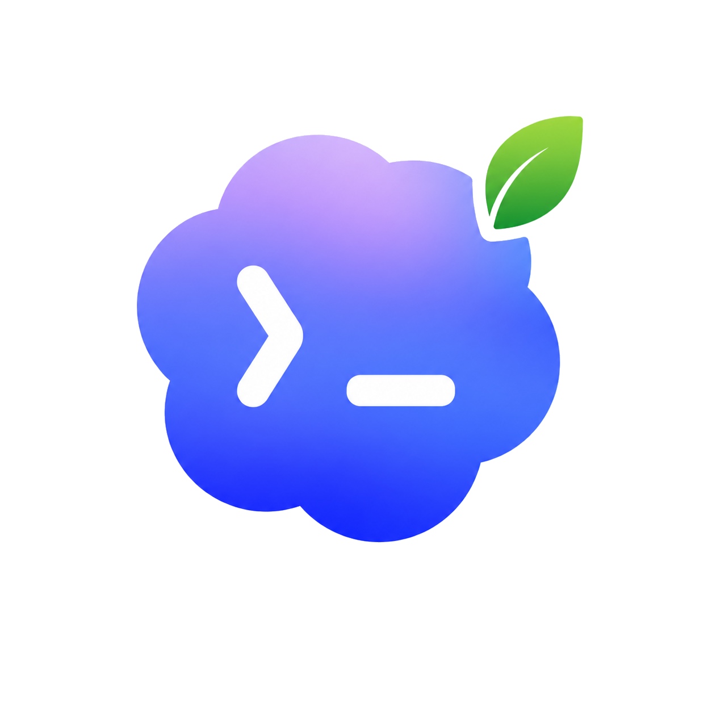

<div align="center">
  
  <h1>Codex Overleaf Link</h1>
  <p><strong>Empower Overleaf with Codex.</strong></p>
  <p>
    
    
    
    
    <a href="https://github.com/Ghqqqq/codex-overleaf-link/actions/workflows/test.yml"></a>
    
    
  </p>
</div>

---

## Why

Overleaf is great for collaborative LaTeX writing. Codex is great for AI-assisted editing. But switching between them breaks flow — you lose Overleaf's real-time collaboration, or you lose Codex's local intelligence.

Codex Overleaf Link bridges the two: it adds a Codex panel directly inside Overleaf, mirrors the project locally for Codex to work on, and writes accepted changes back through the browser — with stale-write guards, diff review, and undo checkpoints to reduce the risk of accidental overwrites.

## Install

```bash
curl -fsSL https://raw.githubusercontent.com/Ghqqqq/codex-overleaf-link/main/install.sh | bash
```

Then load the extension in Chrome:

1. Open `chrome://extensions` (the installer opens it automatically on macOS).
2. Enable **Developer mode**.
3. Click **Load unpacked** and select `~/.codex-overleaf/source/extension`.

Open any Overleaf project — the Codex panel appears on the right.

<details>
<summary><strong>Manual install</strong> (if you prefer a custom location)</summary>

```bash
git clone https://github.com/Ghqqqq/codex-overleaf-link.git
cd codex-overleaf-link
npm run install:native
```

Then load `extension/` as an unpacked extension in Chrome.

</details>

<details>
<summary><strong>Update</strong></summary>

Rerun the same install command — it pulls the latest and reinstalls the native host:

```bash
curl -fsSL https://raw.githubusercontent.com/Ghqqqq/codex-overleaf-link/main/install.sh | bash
```

Then reload the extension in `chrome://extensions` and refresh the Overleaf page.

</details>

<details>
<summary><strong>Uninstall</strong></summary>

```bash
node ~/.codex-overleaf/source/scripts/uninstall-native-host.mjs
```

If you installed from a manual checkout, you can also run `npm run uninstall:native` inside the repo.

Remove the extension from `chrome://extensions`. Optionally delete `~/.codex-overleaf` to remove local mirrors and plugin history.

</details>

## Requirements

| Requirement | Notes |
|-------------|-------|
| macOS | Native Messaging host targets `~/Library/Application Support/Google/Chrome/NativeMessagingHosts/` |
| Chrome / Chromium | Developer mode enabled for unpacked extension |
| Node.js >= 20 | Powers the native host bridge |
| Codex CLI | Installed and logged in (`codex --version` to verify) |
| Overleaf account | Access to the target project |
| MacTeX *(optional)* | For `latexmk` / local compile checks |

## Features

- **Three task modes** — ask-only, suggest-edit (review before write), auto-write (with delete confirmation).
- **Live progress** — Codex events stream into the panel in real time.
- **Stale-write guard** — blocks writes if the file changed since Codex started.
- **Diff review** — per-file diff view before accepting changes.
- **Undo checkpoint** — one-click revert of browser writes.
- **Track Changes integration** — optionally enables Overleaf Reviewing before writing.
- **Auto-recompile** — triggers Overleaf recompile after writeback; logs compile errors as context.
- **@ context** — attach specific files, `@compile-log`, or `@current-section` to the prompt.
- **Model picker** — switch models and reasoning effort from the panel.
- **Session history** — multi-session management with rename, resume, and delete.
- **Isolated Codex home** — plugin sessions stay under `~/.codex-overleaf/codex-home`, not global `~/.codex/sessions`.

## Known Limitations and Safety

- This is an unofficial Overleaf integration. It is not affiliated with or endorsed by Overleaf.
- The browser bridge depends on Overleaf page internals, including editor, project tree, compile, and save-state behavior. Overleaf UI changes may require extension updates.
- Writeback, save detection, and compile-log capture are best-effort browser integrations. Review diffs and keep Overleaf history / Reviewing enabled for important documents.
- Project content is mirrored locally so Codex can work on it. Plugin Codex sessions are stored under `~/.codex-overleaf/codex-home`; local project mirrors are stored under `~/.codex-overleaf/projects`.
- The bridge runs locally and uses your existing Codex CLI account. Project content sent to Codex is handled by Codex/OpenAI under that account; this project does not operate a separate backend.

## How It Works

```
┌─────────────────────────────────────────────────────────────┐
│  Overleaf page                                              │
│    ↕ page bridge (injected script)                          │
├─────────────────────────────────────────────────────────────┤
│  Chrome content script                                      │
│    ↕ chrome.runtime messaging                               │
├─────────────────────────────────────────────────────────────┤
│  Extension service worker                                   │
│    ↕ Native Messaging (stdio)                               │
├─────────────────────────────────────────────────────────────┤
│  Native host (Node.js)                                      │
│    → mirror sync: ~/.codex-overleaf/projects/<id>/workspace │
│    → Codex CLI session                                      │
│    ← collect diffs + patches                                │
├─────────────────────────────────────────────────────────────┤
│  Browser writeback (with stale-write guard + undo)          │
└─────────────────────────────────────────────────────────────┘
```

**Task lifecycle:**

1. Extension captures a project snapshot from Overleaf.
2. Native host syncs the snapshot to a local mirror workspace.
3. Codex runs against the workspace.
4. Native host collects text changes and computes diffs/patches.
5. Extension applies changes back to Overleaf with freshness verification.
6. Mirror baseline is updated after successful writeback.

## Extension ID

This repo ships a stable Chrome extension `key`, producing the deterministic id:

```
illdpneeeopfffmiepaejglgmhpmdhdc
```

If Chrome assigns a different id, reinstall the native host with the actual id:

```bash
cd ~/.codex-overleaf/source && npm run install:native -- --extension-id <your-chrome-extension-id>
```

## Development

```bash
npm test              # Node.js built-in test runner, zero dependencies
npm run bridge        # run the native host directly for protocol work
npm run install:native  # reinstall native host after changing native-host/src or extension/src/shared
```

## Contributing

Contributions are welcome. Please open an issue before submitting large changes so we can discuss the approach.

1. Fork the repository.
2. Create a feature branch.
3. Run `npm test` and ensure all tests pass.
4. Submit a pull request with a clear description.

## License

[MIT](LICENSE)
